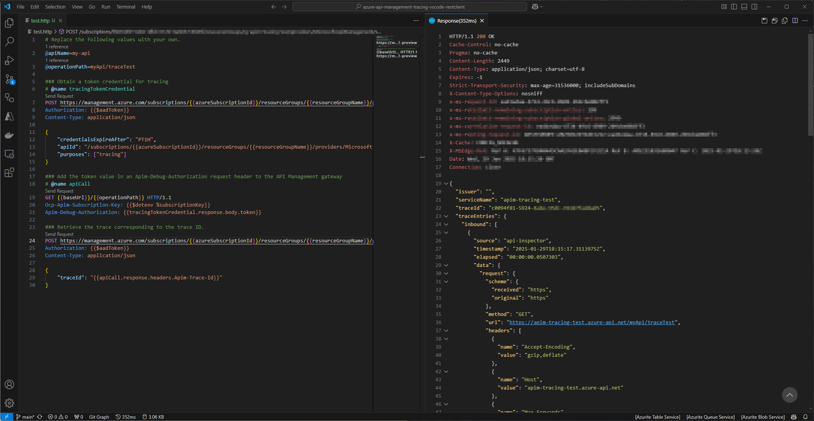

# Azure API Management tracing with VS Code REST Client
[Debug your APIs using request tracing](https://learn.microsoft.com/en-us/azure/api-management/api-management-howto-api-inspector) via the [VS Code REST Client](https://github.com/Huachao/vscode-restclient), using Entra ID device code flow authorization.

## Getting started
1. Install the [VS Code REST Client extension](https://marketplace.visualstudio.com/items?itemName=humao.rest-client)
1. Open `.env` and replace the subscription key values
1. Open `.vscode\settings.json` and replace the variable values
1. Open `test.http` and replace the variables at the top
1. Open the Command Palette (Ctrl+Shift+P) and select `REST Client: Switch Environment`
1. Select the environment you want to apply tracing for, e.g. `dev`
1. Click on `Send Request` of the first operation to obtain a token credential for tracing
   1. A window will pop up to sign into your Microsoft account via a device code, press `Sign in`
   1. A browser window will pop up, fill in the device code, click `Next`, select your account, click `Continue`
   1. Go back to the sign in window and click `Done`
   1. You should now receive a `200 OK` with a token, which will be automatically assigned to the `tracingTokenCredential` variable
1. Click on `Send Request` of the second operation to execute the operation you want to apply tracing on, this will include the token from `tracingTokenCredential`
1. Click on `Send Request` of the third operation to retrieve the trace corresponding to the trace ID which was automatically set via `apiCall`

## FAQ
### When I click `Send Request` nothing happens
This means a variable used in the request has not been set, presumably a `.env` variable.

## Feedback
Please provide feedback through the [GitHub Issue](https://github.com/Jeroen-VdB/azure-api-management-tracing-vscode-restclient/issues) system, or fork the repository and submit PR.